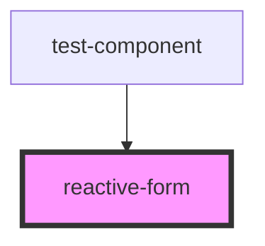

# reactive-form

<!-- Auto Generated Below -->

## Properties

| Property                     | Attribute             | Description | Type        | Default               |
| ---------------------------- | --------------------- | ----------- | ----------- | --------------------- |
| `dataAdditionalSelfHosted`   | --                    |             | `any[]`     | `[]`                  |
| `dataAttributeName`          | `data-attribute-name` |             | `string`    | `'data-form-control'` |
| `dataDebounceTime`           | `data-debounce-time`  |             | `number`    | `0`                   |
| `dataFormGroup` _(required)_ | --                    |             | `FormGroup` | `undefined`           |

## Events

| Event           | Description | Type                                                                                                                               |
| --------------- | ----------- | ---------------------------------------------------------------------------------------------------------------------------------- |
| `statusChanges` |             | `CustomEvent<ReactiveFormStatus.DISABLED \| ReactiveFormStatus.INVALID \| ReactiveFormStatus.PENDING \| ReactiveFormStatus.VALID>` |
| `valueChanges`  |             | `CustomEvent<any>`                                                                                                                 |

## Dependencies

### Used by

 - [test-component](../test-component)

### Graph

----------------------------------------------

*Built with [StencilJS](https://stenciljs.com/)*
