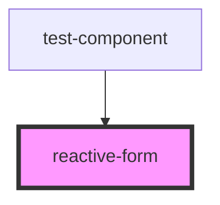

# reactive-form

<!-- Auto Generated Below -->

## Properties

| Property                 | Attribute        | Description | Type        | Default        |
| ------------------------ | ---------------- | ----------- | ----------- | -------------- |
| `additionalSelfHosted`   | --               |             | `any[]`     | `[]`           |
| `attributeName`          | `attribute-name` |             | `string`    | `'rf-control'` |
| `formGroup` _(required)_ | --               |             | `FormGroup` | `undefined`    |

## Events

| Event           | Description | Type               |
| --------------- | ----------- | ------------------ |
| `statusChanges` |             | `CustomEvent<any>` |
| `valueChanges`  |             | `CustomEvent<any>` |

## Dependencies

### Used by

 - [test-component](../test-component)

### Graph

----------------------------------------------

*Built with [StencilJS](https://stenciljs.com/)*
