# test-component

<!-- Auto Generated Below -->

## Dependencies

### Depends on

- ion-item
- ion-chip
- ion-label
- ion-spinner
- [reactive-form](../reactive-form)
- ion-card
- ion-card-content
- ion-icon
- ion-card-header
- ion-card-title
- ion-input
- ion-select
- ion-select-option
- ion-checkbox
- ion-list
- ion-radio-group
- ion-radio
- ion-range
- ion-footer
- ion-toolbar
- ion-buttons
- ion-button
- ion-header
- ion-title
- ion-note
- ion-content
- ion-grid
- ion-row
- ion-col

### Graph

```mermaid
graph TD;
  test-component --> ion-item
  test-component --> ion-chip
  test-component --> ion-label
  test-component --> ion-spinner
  test-component --> reactive-form
  test-component --> ion-card
  test-component --> ion-card-content
  test-component --> ion-icon
  test-component --> ion-card-header
  test-component --> ion-card-title
  test-component --> ion-input
  test-component --> ion-select
  test-component --> ion-select-option
  test-component --> ion-checkbox
  test-component --> ion-list
  test-component --> ion-radio-group
  test-component --> ion-radio
  test-component --> ion-range
  test-component --> ion-footer
  test-component --> ion-toolbar
  test-component --> ion-buttons
  test-component --> ion-button
  test-component --> ion-header
  test-component --> ion-title
  test-component --> ion-note
  test-component --> ion-content
  test-component --> ion-grid
  test-component --> ion-row
  test-component --> ion-col
  ion-item --> ion-icon
  ion-item --> ion-ripple-effect
  ion-chip --> ion-ripple-effect
  ion-card --> ion-ripple-effect
  ion-button --> ion-ripple-effect
  style test-component fill:#f9f,stroke:#333,stroke-width:4px
```

----------------------------------------------

*Built with [StencilJS](https://stenciljs.com/)*
